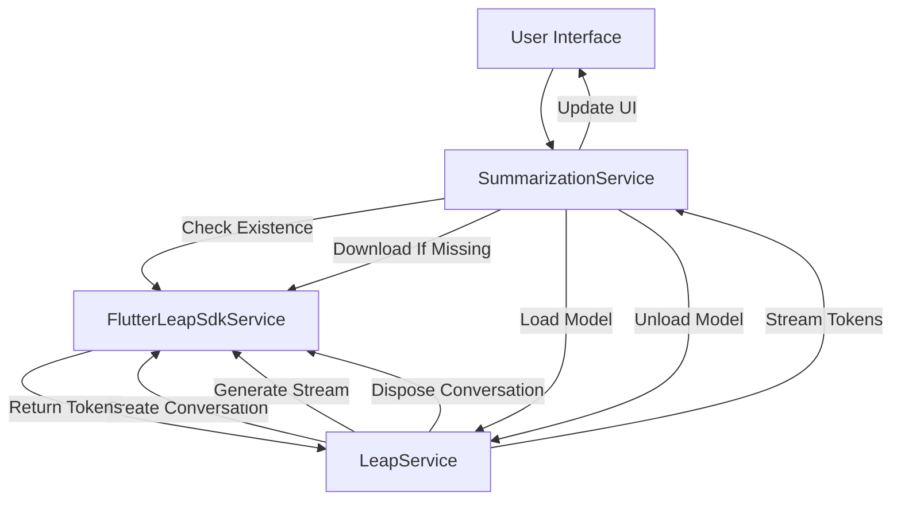

# Liquid AI Leap SDK Implementation

## Overview

This document describes the implementation of on-device AI summarization using the **Liquid AI Leap SDK** (`flutter_leap_sdk`). This implementation replaced the previous ONNX GenAI architecture to leverage Liquid AI's managed model ecosystem and native Flutter integration.

## Architecture

### Core Components

#### 1. **LeapService** (`lib/services/leap_service.dart`)

The primary wrapper service for all Liquid AI Leap SDK interactions.

**Responsibilities:**

- Model loading and lifecycle management
- Conversation context creation and management
- Streaming text generation
- Model caching verification

**Key Methods:**

```dart
Future<void> loadModel(String modelId)
Stream<String> generateStream(String prompt)
Future<bool> isModelCached(String modelId)
Future<void> dispose()
```

**Implementation Details:**

- **Singleton Pattern**: Ensures a single instance manages SDK state
- **Conversation-Based**: Uses persistent `Conversation` objects that maintain chat history and system prompts
- **Streaming**: Native support for token-by-token generation via Dart streams
- **Model ID Support**: Accepts both managed model IDs (e.g., `"Qwen3-1.7B"`) and local file paths

#### 2. **SummarizationService** (`lib/services/summarization_service.dart`)

High-level service orchestrating the summarization workflow.

**Responsibilities:**

- Model download coordination
- Model configuration verification
- Text preprocessing (truncation, formatting)
- Ephemeral loading (load → generate → unload)
- Error handling and user feedback

**Key Methods:**

```dart
Future<void> downloadModelFiles(LLMModel model, ...)
Future<bool> isModelConfigured([LLMModel? model])
Future<String> summarizeWithCallback(String transcript, ...)
```

**Workflow:**

1. Check if model exists via `FlutterLeapSdkService.checkModelExists()`
2. Load model on-demand using `LeapService.loadModel()`
3. Create streaming generation request
4. Collect tokens and invoke callback for UI updates
5. Unload model to free memory

#### 3. **LLMModel** (`lib/models/llm_model.dart`)

Data model defining available AI models.

**Current Model:**

```dart
static const qwenManaged = LLMModel(
  name: 'Qwen3-1.7B',
  description: 'Qwen 3 1.7B (Liquid Managed)',
  estimatedSizeMB: 1200,
  requiredFiles: [],
);
```

**Design:**

- No `localPath` or `downloadUrl` fields required for managed models
- SDK handles all storage and versioning internally
- Model identification via simple string ID

### SDK Integration Flow



## Platform-Specific Details

### Android

**Requirements:**

- `minSdk`: 31 (required by Leap SDK)
- No additional native code or JNI libraries required
- Model storage managed by SDK in app-private directories

**Dependencies:**

```kotlin
// No manual dependencies needed - handled by flutter_leap_sdk
```

**Storage Location:**

- Managed internally by SDK
- Path: `/data/user/0/com.example.senscribe/app_flutter/leap/<model-id>`

### iOS

**Requirements:**

- `platform :ios, '15.0'` (minimum)
- No additional frameworks or native code required
- Model storage in app's `Application Support` directory

**Podfile:**

```ruby
# flutter_leap_sdk handles all native dependencies automatically
```

**Storage Location:**

- Managed internally by SDK
- Typical path: `Library/Application Support/leap/<model-id>`

## Model Management

### Download Process

The SDK provides a native download mechanism:

```dart
await FlutterLeapSdkService.downloadModel(
  modelName: 'Qwen3-1.7B',
  onProgress: (progress) {
    // progress.percentage: 0-100
    final percent = progress.percentage / 100.0;
    onProgress(percent);
  },
);
```

**Features:**

- Automatic resume on interruption
- Progress callbacks for UI updates
- Integrity validation
- Differential updates (if supported by SDK)

### Model Verification

```dart
bool exists = await FlutterLeapSdkService.checkModelExists('Qwen3-1.7B');
```

Checks:

- Model bundle presence
- Integrity checksums
- Version compatibility

## Inference Pipeline

### 1. Preprocessing

```dart
String _truncateIfNeeded(String transcript) {
  if (transcript.length <= 3000) return transcript;
  final truncated = transcript.substring(0, 3000);
  final lastPeriod = truncated.lastIndexOf('.');
  if (lastPeriod > 2400) {
    return '${truncated.substring(0, lastPeriod + 1)} [Text truncated]';
  }
  return '$truncated... [Text truncated]';
}
```

**Rationale:**

- Prevents context overflow
- Maintains sentence boundaries
- User-friendly truncation indicator

### 2. Model Loading

```dart
await FlutterLeapSdkService.loadModel(modelPath: 'Qwen3-1.7B');
```

**Lifecycle:**

- Loads model weights into memory
- Initializes inference engine
- Returns when ready for generation

### 3. Conversation Creation

```dart
final conversation = await FlutterLeapSdkService.createConversation(
  systemPrompt: 'You are a helpful assistant that summarizes text concisely.',
  generationOptions: GenerationOptions(
    temperature: 0.7,
    maxTokens: 512,
  ),
);
```

**Parameters:**

- `systemPrompt`: Defines AI behavior and role
- `temperature`: 0.7 for balanced creativity/consistency
- `maxTokens`: 512 limit for concise summaries

### 4. Streaming Generation

```dart
conversation.generateResponseStream(prompt).listen(
  (token) => onToken(token),
  onDone: () => completer.complete(fullResponse),
  onError: (e) => completer.completeError(e),
);
```

**Benefits:**

- Real-time UI updates
- Lower perceived latency
- Ability to cancel mid-generation

### 5. Cleanup

```dart
await _leapService.dispose();
```

**Purpose:**

- Frees GPU/CPU resources
- Clears conversation context
- Prepares for next inference cycle

## Performance Characteristics

### Android Metrics (Example Run)

From logs on `sdk gphone64 arm64`:

```
Model Load Time:                  1.05 seconds
Total inference time:             0.67 seconds (35.93 tokens/second)
  Prompt evaluation:              0.20 seconds (163.74 tokens/second)
  Generated 24 tokens:            0.47 seconds (51.45 tokens/second)
Time to first generated token:    0.20 seconds
```

**Observations:**

- Fast prompt processing (~164 t/s)
- Moderate generation speed (~51 t/s)
- Low time-to-first-token (<0.2s for good UX)

### Memory Usage

- **Model Size on Disk**: ~1.2 GB (Qwen3-1.7B Q8_0 quantization)
- **Runtime Memory (RSS)**: ~1.26 GB during inference
- **Ephemeral Loading**: Reduces baseline memory when not summarizing

## Error Handling

### Common Errors

#### 1. Model Not Downloaded

```dart
if (!await FlutterLeapSdkService.checkModelExists(name)) {
  throw SummarizationException(
    'Model not found on device. Please download it in Settings.'
  );
}
```

#### 2. Model Loading Failure

```dart
catch (e) {
  debugPrint('LeapService: Failed to load model: $e');
  throw Exception('Failed to load model: $e');
}
```

#### 3. Generation Errors

```dart
stream.listen(
  (token) => ...,
  onError: (e) {
    if (!completer.isCompleted) completer.completeError(e);
  },
);
```

### Recovery Strategy

All errors:

1. Log detailed stack trace
2. Attempt cleanup (`unloadModel()`)
3. Propagate to UI with user-friendly message
4. Reset service state for next request

## UI Integration

### ModelSettingsPage

**Responsibilities:**

- Display model status ("Model Found" / "Model Not Found")
- Initiate download with progress tracking
- Trigger model reload/verification

**Key UI States:**

```dart
bool _isConfigured    // Model exists locally
bool _isDownloading   // Download in progress
double _downloadProgress  // 0.0 - 1.0
String _statusMessage     // User-facing status
```

**Download Flow:**

```dart
await _summarizationService.downloadModelFiles(
  model,
  onProgress: (progress) => setState(() => _downloadProgress = progress),
  onStatus: (status) => setState(() => _statusMessage = status),
);
```

### Transcription Detail Screen

**Integration:**

```dart
final summaryStream = _summarizationService.summarizeWithCallback(
  transcript,
  onToken: (token) {
    setState(() => _summary += token);
  },
);
```

**User Experience:**

- Tokens appear progressively
- Loading indicator during model load
- Error snackbars for failures
- Retry capability on error

## Comparison with ONNX GenAI Implementation

| Aspect                 | ONNX GenAI                         | Leap SDK                                |
| ---------------------- | ---------------------------------- | --------------------------------------- |
| **Model Format**       | ONNX Runtime `.ort` files          | Leap `.bundle` packages                 |
| **Native Code**        | Manual JNI/Obj-C wrappers          | SDK-managed, no custom native code      |
| **Download**           | Manual `Dio` HTTP downloads        | `FlutterLeapSdkService.downloadModel()` |
| **Path Handling**      | Complex platform-specific logic    | SDK-managed, ID-based                   |
| **Conversation State** | Manual prompt construction         | Built-in `Conversation` objects         |
| **Streaming**          | Custom tokenizer + callbacks       | Native stream support                   |
| **Dependencies**       | `onnxruntime-c`, custom `.so` libs | Single `flutter_leap_sdk` package       |
| **Maintenance**        | High (manual native updates)       | Low (SDK handles updates)               |

## Configuration

### Flutter Dependencies

**`pubspec.yaml`:**

```yaml
dependencies:
  flutter_leap_sdk: ^0.2.4
  shared_preferences: ^2.3.4
  path_provider: ^2.1.5
  permission_handler: ^11.4.0
```

### Model Configuration

**Default Model ID:**

```dart
static const String defaultModelId = 'Qwen3-1.7B';
```

**Available Models:**

```dart
static const List<LLMModel> availableModels = [qwenManaged];
```

To add new models:

1. Define new `LLMModel` constant
2. Add to `availableModels` list
3. Ensure model ID matches Leap SDK catalog

## References

- [Liquid AI Leap SDK Documentation](https://pub.dev/packages/flutter_leap_sdk)
- [Qwen Model Family](https://huggingface.co/Qwen)
- [Flutter Platform Channels](https://docs.flutter.dev/platform-integration/platform-channels)

## Changelog

### 2026-01-23: Initial Leap SDK Migration

- Replaced ONNX GenAI with `flutter_leap_sdk`
- Simplified architecture (removed native wrappers)
- Adopted managed model ecosystem
- Implemented ephemeral loading pattern

---

**Last Updated**: January 23, 2026  
**SDK Version**: flutter_leap_sdk ^0.2.4  
**Model**: Qwen3-1.7B (Q8_0)
